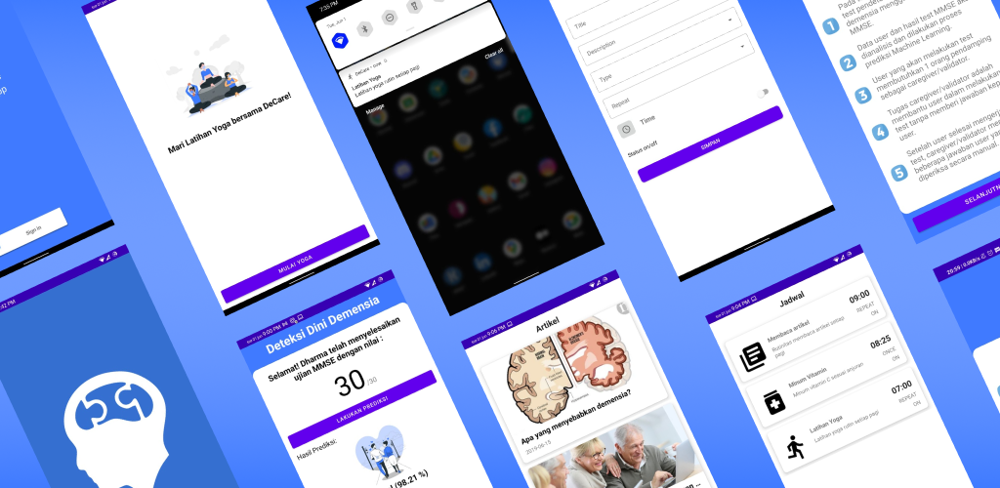

# DeCare-App
[](https://github.com/B21-CAP0075/DeCare-App/blob/master/app/build.gradle)
[](https://github.com/B21-CAP0075/DeCare-App/blob/master/app/build.gradle)
[](https://github.com/B21-CAP0075/DeCare-App/blob/master/app/build.gradle)

> <b>Warning</b>: this app built to accomplish Capstone Project which held by [Bangkit](https://grow.google/intl/id_id/bangkit/). Please be wise to clone and learn the flow of the app.



# What is DeCare ?
Dementia Care is an application to support in-home caregiver to improve quality of dementia patient’s life.


# Our Features
- Login
- Halaman Beranda
- Deteksi Dini
- Jadwal Kegiatan
- Olahraga
- Artikel
- Data Diri
- Panduan Aplikasi

# Screenshots
|</a> |</a>|</a>|
|:-----------:|:--------:|:--------:|
| Splash Screen | Halaman Beranda | Artikel |

|</a> |</a>|</a>|
|:-----------:|:--------:|:--------:|
| Artikel Detail | Jadwal Kegiatan | Jadwal Kegiatan Input |

|</a> |</a>|</a>|
|:-----------:|:--------:|:--------:|
| Notifikasi | Olahraga | Olahraga - Yoga |

|</a> |</a>|</a>|
|:-----------:|:--------:|:--------:|
| Deteksi Dini - Informasi | Deteksi Dini - Instruction | Deteksi Dini - Prediction (Dementia) |

|</a>|
|:--------:|
Deteksi Dini - Prediction (Normal) |

# How to replicate 
- Make sure that you had the latest JDK version
- Make sure that you had the lastest Android Studio version
- Clone this repository using GIT
```
git clone https://github.com/B21-CAP0075/DeCare-App.git
```
- Open the project using Android Studio